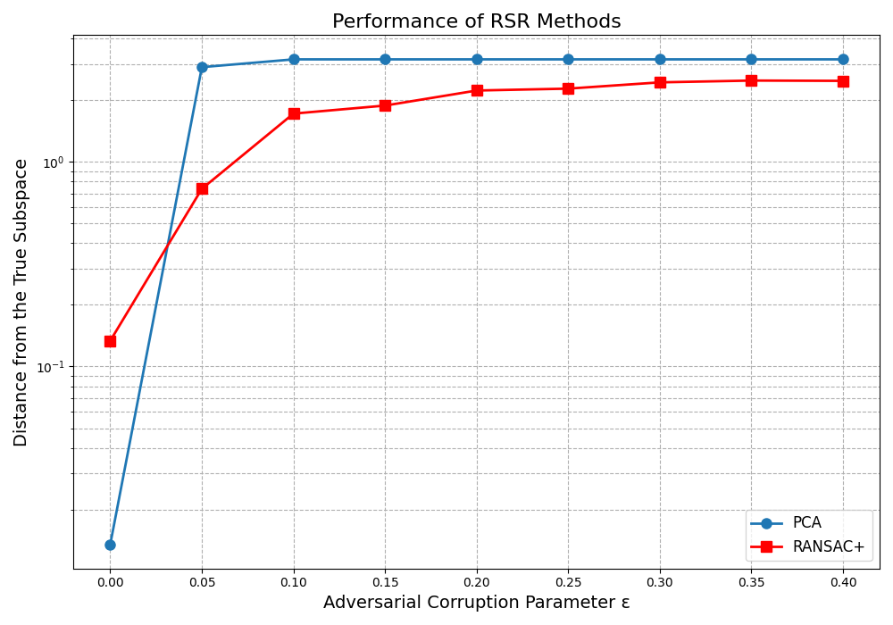

# RANSAC+ Implementation
A Python implementation of the RANSAC+ algorithm from the paper: [arXiv:2504.09648](https://arxiv.org/abs/2504.09648).

## Run
```
python RansacRevisited.py
```
## Output



## Citation & License
This work is based on the paper above and is licensed under the MIT License.

```
@misc{chen2025ransac,
      title={RANSAC Revisited: An Improved Algorithm for Robust Subspace Recovery under Adversarial and Noisy Corruptions}, 
      author={Guixian Chen and Jianhao Ma and Salar Fattahi},
      year={2025},
      eprint={2504.09648},
      archivePrefix={arXiv},
      primaryClass={cs.LG}
}
```